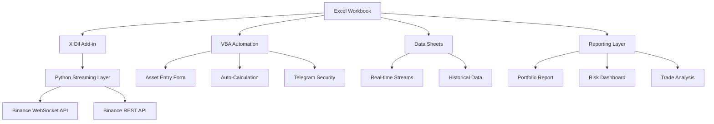
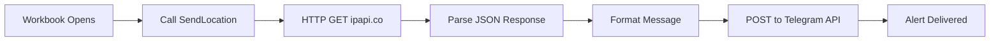

<div align="center">
    
    <p>
        <strong>Enterprise-Grade Real-Time Excel‑Based Bitcoin Market Intelligence, Risk & MIS Platform</strong>
    </p>
</div>
<artifact identifier="btc-mis-documentation" type="text/markdown" title="Bitcoin Real-Time MIS & Risk Analysis - Complete Documentation">
<div align="center">


### 🚀 Real-Time Portfolio Analytics | Advanced Risk Metrics | Institutional-Grade MIS

*A professional-grade Bitcoin portfolio management and risk analysis system built with Excel, Python, and VBA, featuring real-time data streaming, comprehensive analytics, and automated reporting.*

[Features](#-key-features) • [Architecture](#-system-architecture) • [Installation](#-installation) • [Usage](#-usage) • [Documentation](#-documentation)

</div>

---

## 📋 Table of Contents

- [Overview](#-overview)
- [Key Features](#-key-features)
- [System Architecture](#-system-architecture)
- [Installation](#-installation)
- [Workbook Structure](#-workbook-structure)
- [Real-Time Data Streaming](#-real-time-data-streaming)
- [VBA Automation](#-vba-automation)
- [Reports & Dashboards](#-reports--dashboards)
- [Risk Metrics](#-risk-metrics)
- [Security Features](#-security-features)
- [Technical Documentation](#-technical-documentation)
- [Contributing](#-contributing)
- [License](#-license)

---

## 🎯 Overview

The **Bitcoin MIS & Risk Management System** is an enterprise-level portfolio analytics platform that combines the flexibility of Excel with the power of Python streaming to deliver real-time insights into Bitcoin holdings. Built for traders, portfolio managers, and institutions, this system provides:

- ⚡ **Real-time price feeds** via WebSocket streaming
- 📊 **Institutional-grade risk metrics** (CAGR, Sharpe Ratio, Max Drawdown, Volatility)
- 🔐 **Security monitoring** with Telegram integration
- 📈 **Multi-timeframe analysis** from 1-minute to daily intervals
- 🎨 **Professional dashboards** with automated reporting

---

## ✨ Key Features

### 💼 Portfolio Management
- **VBA-Powered Asset Entry Form** with validation and auto-calculations
- **Trade-level Performance Tracking** with unrealized P&L
- **Position Aggregation** across multiple purchase dates
- **Dynamic Portfolio Valuation** updated in real-time

### 📡 Real-Time Data Streaming (XlOil)
| Stream Type | Timeframes | Update Frequency |
|------------|------------|------------------|
| **24h Ticker** | Rolling 24h | Sub-second |
| **Kline Data** | 1m, 15m, 1h, 4h, 1d | Per candle close |
| **Aggregate Trades** | 1m, 5m, 15m, 1h, 4h, 1d | Per trade |
| **All Coins Ticker** | Real-time | Continuous |
| **Comparison Asset** | User-selectable | 1h intervals |

### 📊 Analytics & Reporting
- **Portfolio Equity Curve** visualization
- **Drawdown Analysis** with peak tracking
- **Return Attribution** by purchase cohort
- **Correlation Analysis** vs other cryptocurrencies
- **Trade Microstructure** metrics (order flow, aggressor ratios)

### 🔒 Security & Monitoring
- **Telegram Alert System** on file access
- **Geolocation Tracking** (IP, city, ISP, coordinates)
- **Access Audit Trail** with timestamp and system info
- **Automatic Calculation Refresh** on workbook open

---

## 🏗️ System Architecture



### Technology Stack

| Component | Technology | Purpose |
|-----------|-----------|---------|
| **Frontend** | Microsoft Excel | User interface & visualization |
| **Streaming Engine** | XlOil (Python) | Real-time data integration |
| **Data Source** | Binance API | Market data provider |
| **Automation** | VBA | Form handling & security |
| **Notifications** | Telegram Bot API | Security alerts |

---

## 🚀 Installation

### Prerequisites

```bash
# Required Software
✅ Microsoft Excel 2016 or later
✅ Python 3.8+
✅ XlOil Add-in
```

### Step 1: Install XlOil

```bash
# Via pip
pip install xloil

# Or download installer from
https://github.com/cunnane/xloil/releases
```

### Step 2: Install Python Dependencies

```bash
pip install aiohttp websockets python-dateutil
```

### Step 3: Configure XlOil Functions

1. Place Python files in XlOil modules directory:
   - `aggTrade.py`
   - `AllCoinTicker.py`
   - `CryptoPriceOnDate.py`
   - `KlineStream.py`
   - `TickerStream.py`

2. Default location:
   ```
   %APPDATA%\xloil\modules\
   ```

### Step 4: Enable Macros

1. Open Excel → **File** → **Options** → **Trust Center**
2. Click **Trust Center Settings** → **Macro Settings**
3. Select **Enable all macros** (or sign VBA project)

### Step 5: Configure Telegram (Optional)

In `Module2`, update credentials:

```vba
Const TELEGRAM_BOT_TOKEN As String = "YOUR_BOT_TOKEN"
Const TELEGRAM_CHAT_ID As String = "YOUR_CHAT_ID"
```

---

## 📁 Workbook Structure

### Sheet Navigation

| Sheet Name | Type | Purpose |
|-----------|------|---------|
| 🏠 **Home Page** | Dashboard | Welcome screen with key metrics |
| ➕ **Add Assets** | Form | VBA-powered Bitcoin purchase entry |
| 💼 **Assets** | Data | Portfolio holdings & performance table |
| 📊 **24h Ticker** | Stream | Real-time 24-hour rolling statistics |
| 📈 **1m / 15m / 1h / 4h / 1d** | Stream | OHLCV candlestick data |
| ⏳ **Holding Period** | Stream | Dynamic klines since first purchase |
| 🔄 **AT_1m / 5m / 15m / 1h / 4h / 1d** | Stream | Aggregated trade microstructure |
| 🌐 **All Coins** | Stream | Multi-asset ticker feed |
| 🔀 **Comparing Asset** | Stream | User-selected comparison symbol |
| 🧮 **Stuff** | Helper | Calculated metrics for dashboards |
| 📉 **Trade Analysis** | Planned | Order flow analytics |
| 📑 **Trade Report** | Planned | Transaction history report |
| ⚠️ **Risk and Behavior Metrics** | Analytics | Historical risk calculations |
| 📋 **Portfolio Report** | Report | Visual performance summary |
| ℹ️ **Info** | Static | Educational Bitcoin content |
| 🎛️ **Dashboard** | Planned | Unified MIS view |
| 🟢 **Data_Status** | Monitor | Stream health indicators |

---

## 📡 Real-Time Data Streaming

### Architecture Overview

All streaming functions use **XlOil's async RTD** capabilities to push live data from Binance WebSocket and REST APIs directly into Excel cells.

### 1️⃣ 24-Hour Ticker Stream

**Formula:** `=TickerStream("BTCUSDT", "c")`

**Available Fields:**

| Field | Key | Example Formula |
|-------|-----|----------------|
| Last Price | `c` | `=TickerStream("BTCUSDT", "c")` |
| Price Change % | `P` | `=TickerStream("BTCUSDT", "P")/100` |
| High Price | `h` | `=TickerStream("BTCUSDT", "h")` |
| Low Price | `l` | `=TickerStream("BTCUSDT", "l")` |
| Volume (24h) | `v` | `=TickerStream("BTCUSDT", "v")` |

**Implementation (`TickerStream.py`):**

```python
@xloil.func
async def TickerStream(symbol: str, field: str):
    """Stream single Binance ticker field to Excel"""
    key = Ticker_Field_Name.get(field, field)
    res = BinanceTickerStream(symbol.lower(), key)
    
    while True:
        value = await asyncio.to_thread(next, res)
        yield value  # Updates Excel cell
        await asyncio.sleep(0)
```

**Data Flow:**

```
Binance WS → Python Generator → XlOil → Excel Cell (auto-refresh)
```

---

### 2️⃣ Kline (Candlestick) Streams

**Formula:** `=KlineStream("BTCUSDT", "1h", 500)`

**Parameters:**
- `symbol`: Trading pair (e.g., "BTCUSDT")
- `interval`: `1m`, `15m`, `1h`, `4h`, `1d`
- `limit`: Number of historical candles to backfill

**Output Columns:**

| Column | Description |
|--------|-------------|
| OpenDateTimeIST | Candle open time (IST timezone) |
| Open / High / Low / Close | OHLC prices |
| Volume | Base asset volume |
| QuoteAssetVolume | Quote asset volume (USDT) |
| NumberOfTrades | Trade count in candle |
| TakerBuyBaseVol | Aggressive buy volume |

**Features:**
- ✅ **Auto-backfill** via REST API on startup
- ✅ **WebSocket updates** for real-time candles
- ✅ **Auto-refresh** on candle close
- ✅ **Rolling buffer** to maintain `limit` rows

---

### 3️⃣ Aggregate Trade Streams

**Formula:** `=AggTradeStreamWindow("BTCUSDT", 60)`

**Parameters:**
- `symbol`: Trading pair
- `minutes`: Time window (e.g., 60 = last 1 hour)

**Output Columns:**

| Column | Description |
|--------|-------------|
| TradeTimeIST | Execution timestamp |
| Price | Trade price |
| Quantity | Trade size (BTC) |
| AggTradeID | Binance aggregate trade ID |
| IsBuyerMaker | True if sell order hit bid |
| IsBestMatch | Best price match flag |

**Use Cases:**
- Order flow analysis
- Aggressor identification (buy vs sell pressure)
- High-frequency trade reconstruction

---

### 4️⃣ All Coins Ticker

**Formula:** `=AllCoinsTickerStream()`

**Returns:** Live table of **all Binance symbols** with:
- Last Price
- 24h Change %
- High / Low
- Volume

**Update Frequency:** Real-time (every tick)

---

### 5️⃣ Comparison Asset Stream

**Formula:** `=KlineStream($F$1, "1h", 500)`

**Dynamic Symbol Selection:**
- Cell `F1` contains dropdown list of symbols
- Stream auto-updates when selection changes
- Enables correlation analysis vs Bitcoin

---

## 🤖 VBA Automation

### Module 1: ForceFullRecalc

**Purpose:** Ensures complete formula recalculation on workbook open.

```vba
Public Sub ForceFullRecalc()
    Application.CalculateFullRebuild
End Sub
```

**When Called:** 3 seconds after workbook opens (via `Workbook_Open`)

**Why Needed:** Excel's calculation engine can cache stale values after file closure. This forces a fresh calculation chain rebuild.

---

### Module 2: Telegram Security Integration

**Purpose:** Sends real-time access alerts with geolocation to Telegram.

**Captured Data:**
- 📅 File open timestamp
- 👤 Windows username
- 💻 Computer name
- 🌍 Public IP address
- 📍 City, region, country
- 🗺️ GPS coordinates
- 🌐 ISP details
- ⏰ Timezone

**Sample Alert:**

```
🔔 FILE OPENED - LOCATION ALERT

Time: 19-Jan-2026 12:30:45 PM

Location Details:
IP Address: 203.0.113.45
City: Patna
Region: Bihar
Country: India
Coordinates: 25.5941° N, 85.1376° E
ISP: Jio Infocomm Ltd

User: JohnDoe
PC Name: DESKTOP-ABC123
```

**Implementation Flow:**



---

### Module 3: Asset Entry Automation

**Purpose:** Structured data entry from "Add Assets" form to "Assets" table.

**Process:**

1. **User enters data** in form cells:
   - `G6`: Quantity (BTC)
   - `G11`: Purchase Date
   - `G16`: Buy Price (auto-fetched via `CryptoPriceOnDate`)
   - `G21`: Invested Amount (auto-calculated)

2. **Submit button triggers:**
   ```vba
   Sub Submit_Bitcoin_Data()
       ' Add row to Assets table
       ' Map form values to table columns
       ' Clear input fields
       ' Show success message (auto-clears after 2s)
   End Sub
   ```

3. **Data validation:**
   - Buy Price auto-fetched: `=CryptoPriceOnDate("BTCUSDT", G11)`
   - Invested Amount: `=G6 * G16`

---

### ThisWorkbook: Startup Sequence

```vba
Private Sub Workbook_Open()
    Sheets("Home Page").Activate
    Application.OnTime Now + TimeValue("00:00:03"), "ForceFullRecalc"
    Call SendLocation  ' Security alert
End Sub
```

**Execution Order:**
1. Navigate to Home Page
2. Wait 3 seconds
3. Force full recalculation
4. Send Telegram access notification

---

## 📊 Reports & Dashboards

### Portfolio Report Sheet

**Components:**

#### 📌 Summary Cards

| Metric | Data Source | Formula |
|--------|-------------|---------|
| Total Investment | Assets Table | `SUM(Invested Amount)` |
| Current Value | Real-time Price × Quantity | `Current Price × Total Quantity` |
| Total P&L | Current - Invested | `Current Value - Total Investment` |
| Total Return % | P&L / Investment | `(Total P&L / Total Investment) × 100` |
| Holding Days | Purchase to Now | `MAX(Days Held)` |
| CAGR % | Annualized Return | `((Final/Initial)^(365/Days) - 1) × 100` |
| Max Drawdown % | Peak to Trough | `MIN(Drawdown %)` from Risk sheet |

#### 📈 Portfolio Equity Curve

- **X-Axis:** Date (from Risk & Behavior Metrics)
- **Y-Axis:** Portfolio Value (USD)
- **Data Points:** Daily snapshots since first purchase

#### 📉 Drawdown Curve

- **X-Axis:** Date
- **Y-Axis:** Drawdown % (negative scale)
- **Visualization:** Area chart showing underwater equity

---

### Risk & Behavior Metrics Sheet

**Calculated Fields:**

| Metric | Formula | Purpose |
|--------|---------|---------|
| **Portfolio Value** | `Total Quantity × Daily Close Price` | Historical valuation |
| **Running Peak** | `MAX(Portfolio Value to date)` | High-water mark |
| **Drawdown %** | `(Current Value / Running Peak - 1) × 100` | Peak-to-trough decline |
| **Log Return** | `LN(Today's Price / Yesterday's Price)` | Continuously compounded return |
| **P&L Amount** | `Today's Value - Yesterday's Value` | Daily profit/loss |

**Data Source:** `Holding Period` kline sheet (daily OHLC since first purchase)

---

## ⚠️ Risk Metrics

### Portfolio-Level Metrics (Assets Sheet)

```
📊 Portfolio Summary
━━━━━━━━━━━━━━━━━━━━━━━━━━━━━
Total Quantity:         0.55 BTC
Total Invested:         $25,034.95
Current Price:          $92,561.83
Current Value:          $50,909.01
Absolute P&L:           $25,874.06
P&L %:                  103.35%
Holding Days:           762 Days
Annualized Return:      40.49%
Max Drawdown:           -32.02%
Volatility (annual):    46.93%
```

### Risk Calculations

#### 1. CAGR (Compound Annual Growth Rate)

```excel
=((Current Value / Total Invested)^(365 / Holding Days) - 1) * 100
```

**Example:**
- Invested: $25,034.95
- Current: $50,909.01
- Days: 762
- CAGR: **40.49%**

#### 2. Max Drawdown

```excel
=MIN(Drawdown %) from Risk & Behavior Metrics sheet
```

**Interpretation:** Largest peak-to-trough decline = **-32.02%**

#### 3. Annualized Volatility

```excel
=STDEV(Log Returns) * SQRT(365) * 100
```

**Result:** **46.93%** (typical for Bitcoin)

---

## 🔐 Security Features

### Access Monitoring

| Feature | Implementation | Alert Method |
|---------|----------------|--------------|
| **File Access Logging** | `Workbook_Open` event | Telegram message |
| **Geolocation Tracking** | ipapi.co integration | IP-based city/country |
| **User Identification** | `Environ("USERNAME")` | Windows login |
| **System Fingerprinting** | `Environ("COMPUTERNAME")` | Device name |
| **Timestamp Logging** | `Format(Now, ...)` | ISO 8601 format |

### Privacy & Compliance Notes

⚠️ **Warning:** Telegram integration sends sensitive location data externally. Ensure compliance with:
- GDPR (if EU users)
- Company data policies
- User consent requirements

**Recommendation:** Remove Module2 or disable `Call SendLocation` in production if privacy is a concern.

---

## 🛠️ Technical Documentation

### Python Streaming Architecture

#### XlOil RTD Protocol

XlOil enables **asynchronous Python generators** to push data to Excel cells:

```python
@xlo.func
async def MyStream():
    while True:
        value = fetch_data()
        yield value  # Excel cell updates
        await asyncio.sleep(1)
```

**Benefits:**
- ✅ No manual refresh needed
- ✅ Handles WebSocket reconnections
- ✅ Thread-safe async I/O

#### Connection Resilience

All streaming functions include:

1. **Auto-reconnect** on WebSocket errors
2. **Last known value persistence** during disconnections
3. **Status indicators** (`LIVE` / `DISCONNECTED`)

**Example from `KlineStream.py`:**

```python
while True:
    try:
        async with websockets.connect(ws_url) as ws:
            async for msg in ws:
                # Process and yield data
                yield table
    except Exception:
        # Show last snapshot with DISCONNECTED status
        if last_snapshot:
            fallback = last_snapshot[:-1] + [STATUS_ROW_DOWN]
            yield fallback
        await asyncio.sleep(5)  # Wait before retry
```

---

### Excel Formula Reference

#### Dynamic Arrays

All streaming functions return **spilled arrays**:

```
=KlineStream("BTCUSDT", "1h", 500)
```

Excel automatically creates a table starting from formula cell, expanding down/right as data updates.

#### Volatile Functions

Streaming formulas are **non-volatile** but update via RTD, meaning:
- ✅ Don't trigger on every Excel recalculation
- ✅ Update only when Python yields new data
- ✅ CPU-efficient for large workbooks

---

### Data Sources

#### Binance API Endpoints

| Type | Endpoint | Rate Limit |
|------|----------|------------|
| REST Klines | `/api/v3/klines` | 1200/min |
| REST AggTrades | `/api/v3/aggTrades` | 1200/min |
| WebSocket Ticker | `wss://.../ticker` | Unlimited |
| WebSocket Kline | `wss://.../kline_{interval}` | Unlimited |

**No API Key Required** (public market data)

---

## 🤝 Contributing

Contributions welcome! Please:

1. Fork the repository
2. Create feature branch (`git checkout -b feature/AmazingFeature`)
3. Commit changes (`git commit -m 'Add AmazingFeature'`)
4. Push to branch (`git push origin feature/AmazingFeature`)
5. Open Pull Request

---

## 📄 License

This project is provided as-is for educational and personal use. 

**Disclaimer:** Not financial advice. Use at your own risk. Cryptocurrency trading involves substantial risk of loss.

---

## 📞 Support

For issues or questions:

- 📧 Email: [your-email@example.com]
- 💬 Telegram: [@yourusername]
- 🐛 Issues: [GitHub Issues](https://github.com/yourusername/repo/issues)

---

<div align="center">

**⭐ Star this repo if you find it useful!**

Made with ❤️ for the crypto community


</div>