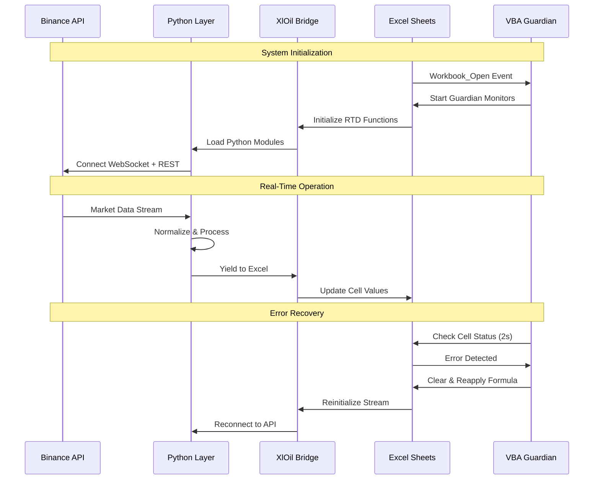

<artifact identifier="btc-mis-documentation" type="text/markdown" title="Bitcoin Real-Time MIS & Risk Analysis - Complete Documentation">
<div align="center">


**Enterprise-Grade Real-Time Excel‑Based Bitcoin Market Intelligence, Risk & MIS Platform**

*Comprehensive Risk Analytics | Live Market Data | Advanced Visualization*

[Features](#-key-features) • [Installation](#-installation) • [Documentation](#-documentation) • [Architecture](#-system-architecture)

---

</div>

## 📋 Table of Contents

---

## 🎯 Overview

The **Bitcoin Real-Time MIS & Risk Analysis System** is an enterprise-grade financial analytics platform that provides institutional-quality market intelligence, risk assessment, and portfolio management for cryptocurrency trading operations. Built on a sophisticated real-time data streaming architecture, this system delivers sub-second market updates, multi-timeframe technical analysis, and comprehensive risk metrics through an intuitive Excel-based interface.

### 🎓 Project Objectives
### 💡 Core Value Proposition

---

## ✨ Key Features

### 🔴 Real-Time Market Data Streaming
### 🛡️ Risk Management & Analytics
### 📊 Dashboard & Visualization

---

## 🏗️ System Architecture

### High-Level Architecture Diagram

```
┌─────────────────────────────────────────────────────────────────────────┐
│                         BINANCE EXCHANGE LAYER                          │
│  • Spot Trading API (REST)                                              │
│  • WebSocket Stream API (Real-Time)                                     │
└────────────────────────────────┬────────────────────────────────────────┘
                                 │
                    ┌────────────┴────────────┐
                    │   NETWORK LAYER         │
                    │   • TLS/SSL Encryption  │
                    │   • Ping/Pong Keepalive │
                    └────────────┬────────────┘
                                 │
┌────────────────────────────────┴────────────────────────────────────────┐
│                        PYTHON INTEGRATION LAYER                          │
│  ┌──────────────┐  ┌──────────────┐  ┌──────────────┐  ┌─────────────┐│
│  │TickerStream  │  │ KlineStream  │  │  aggTrade    │  │AllCoinTicker││
│  │    .py       │  │    .py       │  │  Stream.py   │  │   .py       ││
│  └──────┬───────┘  └──────┬───────┘  └──────┬───────┘  └──────┬──────┘│
│         │                  │                  │                  │       │
│         │    ┌────────────────────────────────┤                  │       │
│         │    │         XlOil Bridge           │                  │       │
│         └────┤      (RTD Functions)           ├──────────────────┘       │
│              └────────────┬───────────────────┘                          │
└───────────────────────────┴──────────────────────────────────────────────┘
                            │
┌───────────────────────────┴──────────────────────────────────────────────┐
│                    EXCEL APPLICATION LAYER                                │
│  ┌────────────────────────────────────────────────────────────────────┐  │
│  │                     VBA GUARDIAN SYSTEM                            │  │
│  │  • Core Monitor (2s cycle)    • Candle Monitor (2s cycle)         │  │
│  │  • AggTrade Monitor (10s cycle)                                    │  │
│  │  • Auto-Recovery Logic         • Error Detection                   │  │
│  └────────────────────────────────────────────────────────────────────┘  │
│                                                                           │
│  ┌─────────────┐ ┌─────────────┐ ┌─────────────┐ ┌──────────────────┐  │
│  │  24h Ticker │ │ OHLC Sheets │ │ AggTrade    │ │  Analytics       │  │
│  │   (17 KPIs) │ │(1m-4h-1d)   │ │  Windows    │ │  (Risk Models)   │  │
│  └─────────────┘ └─────────────┘ └─────────────┘ └──────────────────┘  │
│                                                                           │
│  ┌──────────────────────────────────────────────────────────────────┐   │
│  │                   DASHBOARD & REPORTING LAYER                     │   │
│  │  • Interactive Charts    • Risk Dashboards    • Alert System     │   │
│  └──────────────────────────────────────────────────────────────────┘   │
└───────────────────────────────────────────────────────────────────────────┘
```

### Component Interaction Flow



---

## 📊 Data Architecture & Implementation
### Overview
### 🏗️ Data Architecture Layers
### 🔧 Technical Implementation Details
### 📈 Data Quality & Reliability
#### Time Synchronization
#### Connection Resilience
#### Data Integrity Measures
---

### 🚀 Performance Characteristics
#### System Performance Metrics
#### Rate Limits & Compliance
---

### 📊 Data Schema Reference
### 🔄 Complete Data Flow Diagram
---

## 🛡️ Automated Error Recovery System (VBA)

## 🚀 Installation & Setup

> **Status:** *Detailed installation instructions will be provided upon project completion.*

### Prerequisites
- Windows 10/11 (64-bit)
- Microsoft Excel 2016 or later (Microsoft 365 recommended)
- Python 3.9 or higher
- Stable internet connection (minimum 1 Mbps)

### Quick Start
1. Install Python dependencies
2. Install XlOil
3. Load Python modules
4. Open Excel workbook
5. Enable macros
6. Guardian system auto-starts

### Detailed Setup
*(Coming soon)*

---

